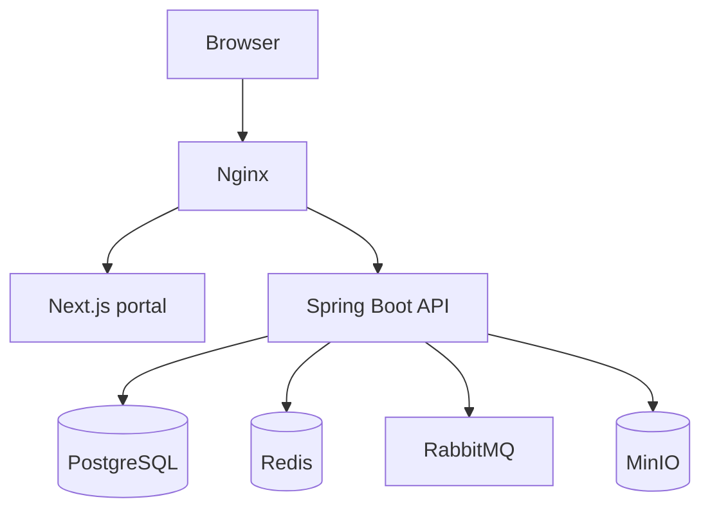

# Architecture

## Shape

Rabbit Milestones 1 and 2 use a modular monolith. This preserves strong transactional boundaries while the product and domain model are still evolving.

## Core boundaries

| Boundary | Responsibility |
| --- | --- |
| `auth` | Credentials, organisation selection, JWT and refresh rotation |
| `organisation` | Tenant and academic structure |
| `user` | Global identity, membership, role, status |
| `question` | MCQ authoring, options, metadata, validation, governance |
| `assessment` | Drafts, approved question composition, publishing and schedule |
| `attempt` | Student session, auto-save, submission, scoring and basic result |
| `evaluation` | Governed publication and re-evaluation of objective results |
| `report` | Published-data analytics, intelligence rules, and CSV snapshots |
| `dashboard` | Role-specific metrics, trends, and attention queues |
| `notification` | Tenant/user inbox, preferences, delivery status, and retry worker |
| `audit` | Immutable event capture, search, trace context, and export |
| `settings` | Organisation defaults, grading bands, branding, subjects, and topics |
| `common` | Errors, audit fields, tenant context and API conventions |

## Multi-tenancy

- Identity is global; an organisation membership assigns role and tenant access.
- Tenant-owned tables carry `organisation_id`.
- The selected organisation is signed into the access token as `org_id`.
- Services obtain the tenant from the authenticated context and use tenant-scoped repository methods.
- Client-supplied organisation identifiers never override the signed tenant context.
- Database row-level security is a planned defence-in-depth control before production GA.

## Security

- Passwords are BCrypt-hashed with strength 12.
- Access tokens are short lived; refresh tokens rotate and are persisted as SHA-256 hashes.
- The Next.js gateway keeps tokens in secure, HttpOnly, same-site cookies.
- Method-level role checks guard administrative and academic workflows.
- API errors use one stable envelope and do not disclose stack traces.
- Secrets are injected through the environment and are never stored in source.

## Reliability

- Responses are saved on question navigation and every 30 seconds.
- Attempts are resumable from persisted responses.
- Submission is idempotent: an already-submitted attempt returns its stored result.
- Database constraints protect core invariants in addition to service validation.
- Result publication is separate from evaluation; students cannot see scores before a governed publish action.
- Re-evaluation increments the evaluation version, resets publication state, and records before/after values.
- Reports only consume published results, preventing premature or mutable data from entering intelligence views.
- In-app notifications are persisted and retryable; RabbitMQ remains available for environment-specific external delivery adapters.
- Redis, RabbitMQ, and MinIO remain provisioned for GA caching, external-channel delivery, and file workflows.
