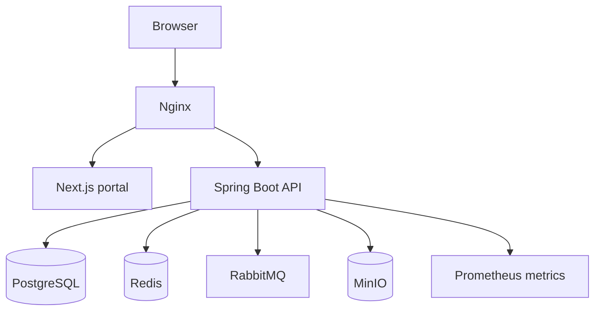

# Release 1.0 architecture

## Shape

Rabbit Release 1.0 uses a modular monolith. This preserves strong transactional boundaries while the product and domain model are still evolving.

## Core boundaries

| Boundary | Responsibility |
| --- | --- |
| `auth` | Credentials, organisation selection, JWT and refresh rotation |
| `organisation` | Tenant and academic structure |
| `user` | Global identity, membership, role, status |
| `question` | MCQ authoring, options, metadata, validation, governance |
| `assessment` | Drafts, approved question composition, publishing and schedule |
| `attempt` | Student session, auto-save, submission, scoring and basic result |
| `evaluation` | Governed publication and re-evaluation of objective results |
| `report` | Published-data analytics, intelligence rules, and CSV snapshots |
| `dashboard` | Role-specific metrics, trends, and attention queues |
| `notification` | Tenant/user inbox, preferences, delivery status, and retry worker |
| `audit` | Immutable event capture, search, trace context, and export |
| `settings` | Organisation defaults, grading bands, branding, subjects, and topics |
| `feature` | Tenant feature flags, deterministic rollout, and audit |
| `operations` | Dependency probes, traffic, capacity, workflow health, and release gates |
| `pilot` | Tenant UAT evidence, mandatory exit gates, locked institutional sign-off, and audit |
| `common` | Errors, audit fields, tenant context and API conventions |

## Multi-tenancy

- Identity is global; an organisation membership assigns role and tenant access.
- Tenant-owned tables carry `organisation_id`.
- The selected organisation is signed into the access token as `org_id`.
- Services obtain the tenant from the authenticated context and use tenant-scoped repository methods.
- Client-supplied organisation identifiers never override the signed tenant context.
- PostgreSQL triggers independently reject cross-tenant question, assessment, attempt, response, section, and option relationships.
- CI applies every real PostgreSQL migration and executes negative isolation contracts.
- Service repositories still require the signed organisation scope, so application and database controls reinforce each other.

## Security

- Passwords are BCrypt-hashed with strength 12.
- Access tokens are short lived; refresh tokens rotate and are persisted as SHA-256 hashes.
- The Next.js gateway keeps tokens in secure, HttpOnly, same-site cookies.
- Method-level role checks guard administrative and academic workflows.
- API errors use one stable envelope and do not disclose stack traces.
- Secrets are injected through the environment and are never stored in source.
- The production profile refuses local/default secrets, wildcard/local CORS, and an unidentified environment.
- Redis-backed per-identity limits and Nginx per-IP limits protect authentication and API traffic.
- Nginx applies clickjacking, MIME-sniffing, referrer, permissions, and content-security headers.
- Sensitive report downloads are no-store and feature-flag governed.

## Reliability

- Responses are saved on question navigation and every 30 seconds.
- Attempts are resumable from persisted responses.
- Submission is idempotent: an already-submitted attempt returns its stored result.
- Database constraints protect core invariants in addition to service validation.
- Result publication is separate from evaluation; students cannot see scores before a governed publish action.
- Re-evaluation increments the evaluation version, resets publication state, and records before/after values.
- Reports only consume published results, preventing premature or mutable data from entering intelligence views.
- In-app notifications are persisted and retryable; RabbitMQ remains available for environment-specific external delivery adapters.
- Redis, RabbitMQ, and MinIO remain provisioned for GA caching, external-channel delivery, and file workflows.
- Liveness/readiness probes, Prometheus metrics, trace IDs, request/error/latency counters, pool capacity, and tenant workflow backlogs support operations.
- Tagged release workflows publish immutable API and web images with SBOM and provenance after environment approval.
- Backups cover PostgreSQL and MinIO with a checksum manifest; restore requires an explicit destructive confirmation and post-restore smoke test.
- Database connection, pool, and Flyway locations are environment-configured, so
  the local PostgreSQL data can later move to another PostgreSQL instance without
  product-code changes. PostgreSQL-specific tenant triggers remain an explicit
  safety boundary; a different database engine requires a controlled adaptation.
- Authenticated web screens do not substitute demo data when an API call fails; loading,
  empty, and error states preserve the integrity of pilot evidence.
- Pilot evidence is tenant-scoped, sign-off is blocked until every mandatory check
  passes, and the register becomes immutable after authorisation.

See [Database portability](DATABASE_PORTABILITY.md) for the supported migration
boundary and future move procedure.
